# Kanban System — Complete Flowchart

## 1. Ticket Lifecycle (State Machine)

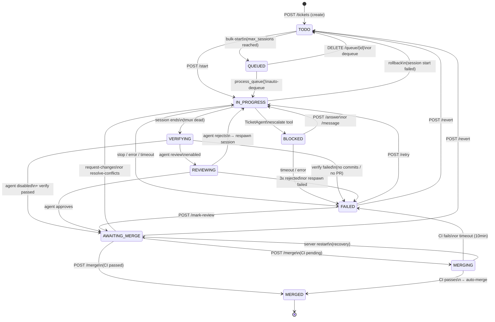

## 2. Start Ticket — Full Flow

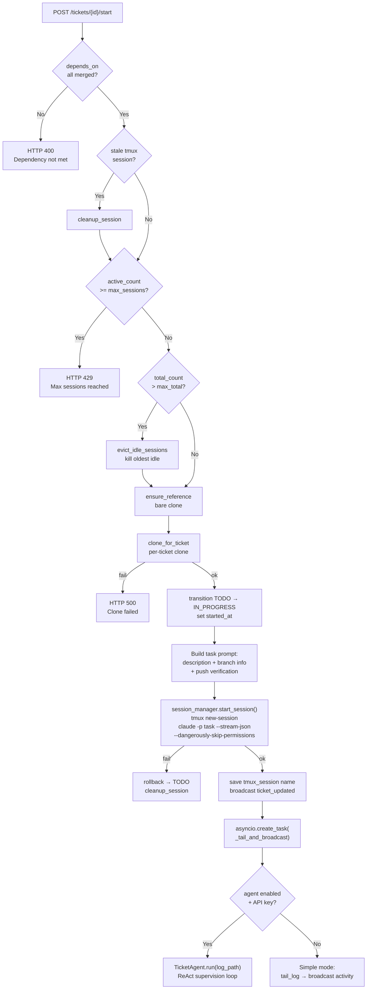

## 3. TicketAgent ReAct Loop

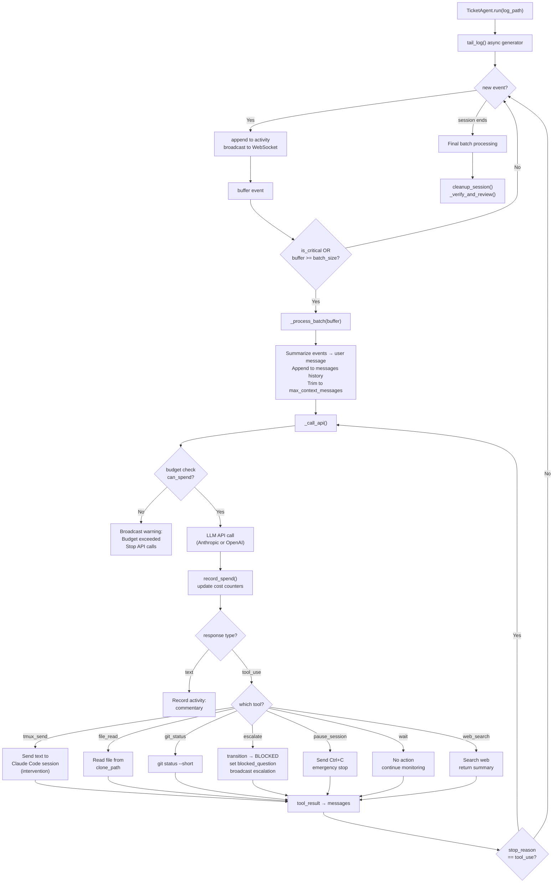

## 4. Verify & Review Flow

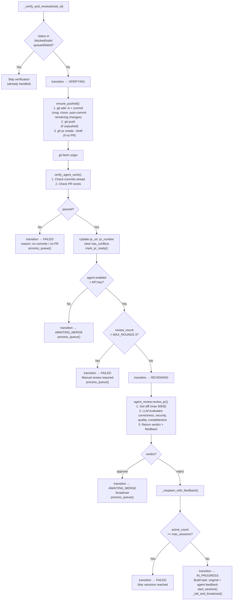

## 5. Merge Flow

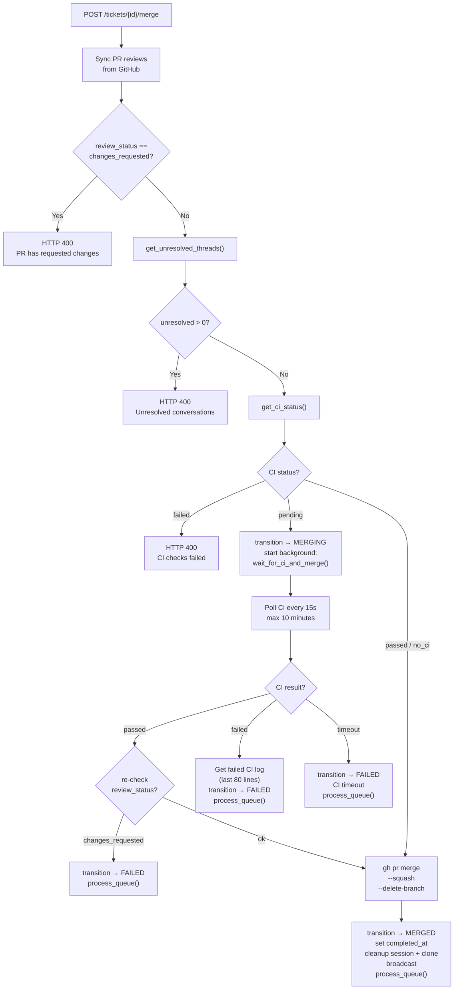

## 6. Request Changes & Conflict Resolution

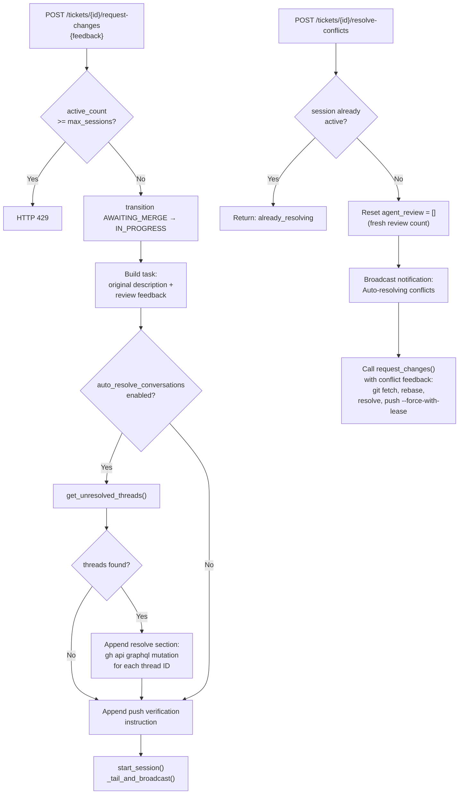

## 7. Queue System

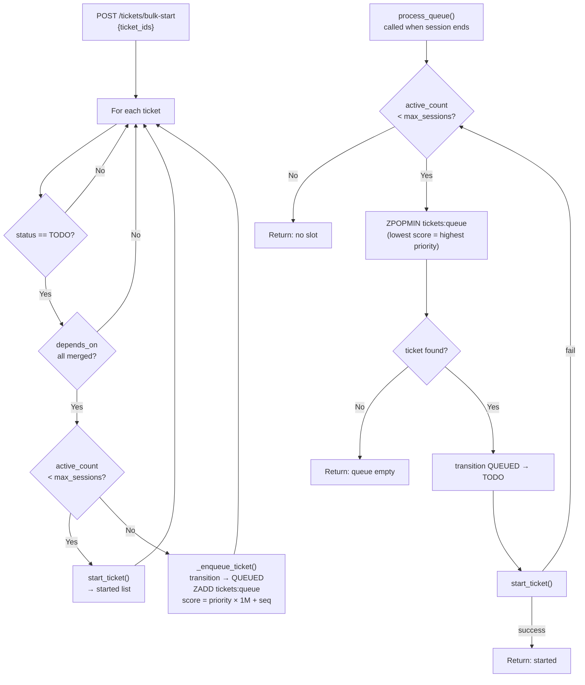

## 8. GitHub Webhook Handling

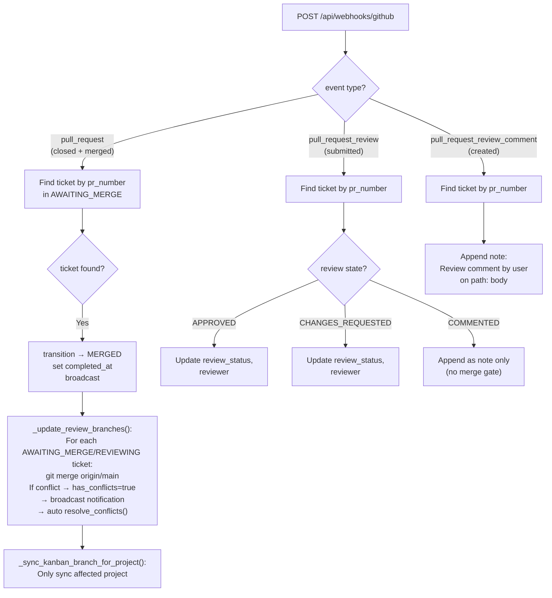

## 9. Backend Poll Loop (every 10s)

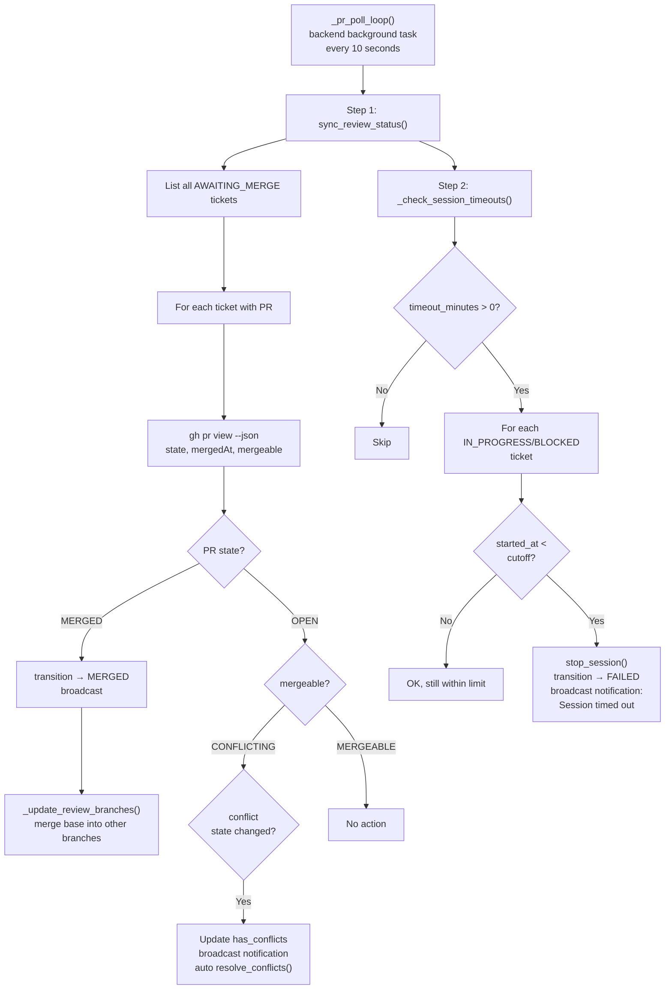

## 10. Server Startup Recovery

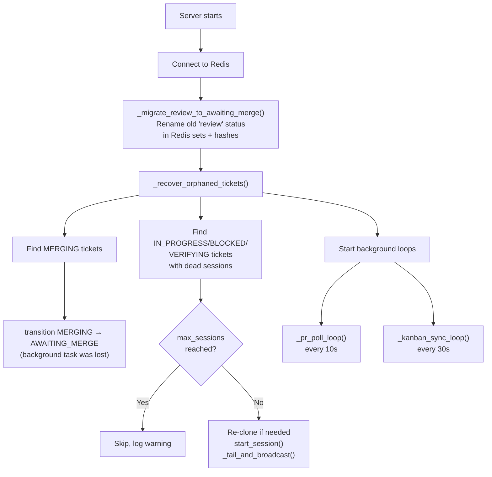

## 11. Kanban Claude Code Session (Interactive Terminal)

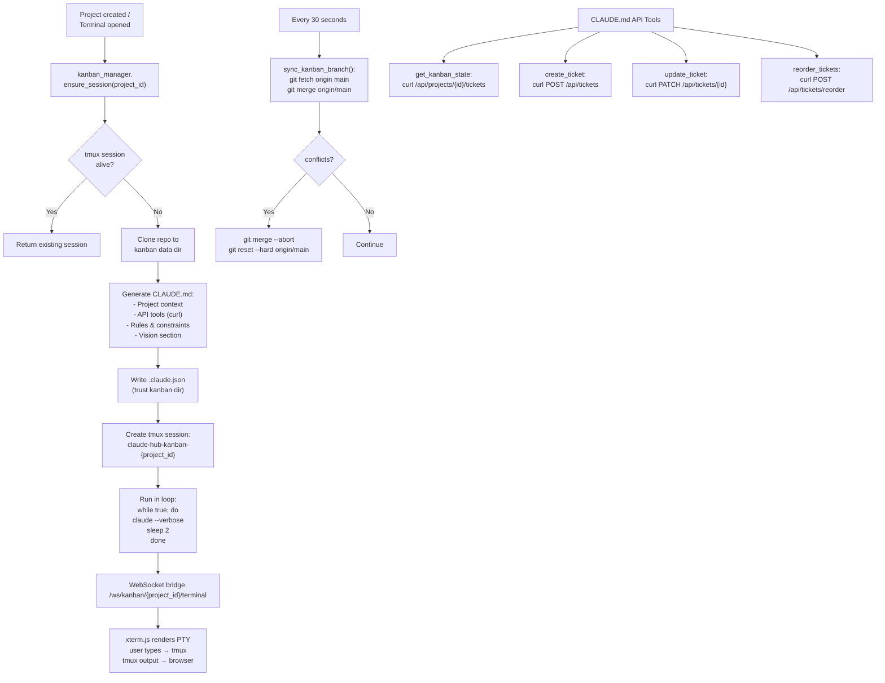

## 12. Complete Data Flow Overview

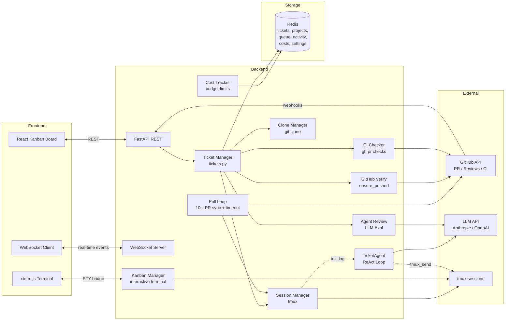
